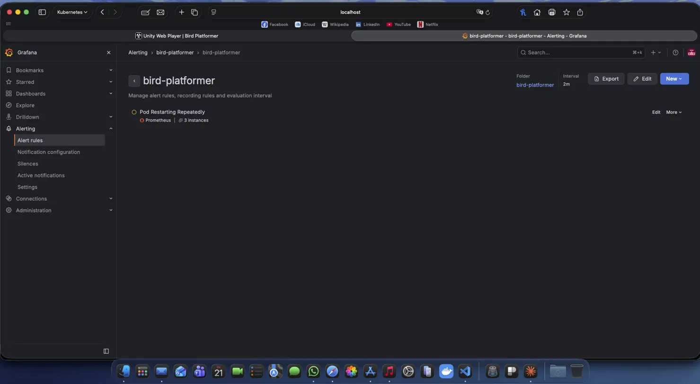
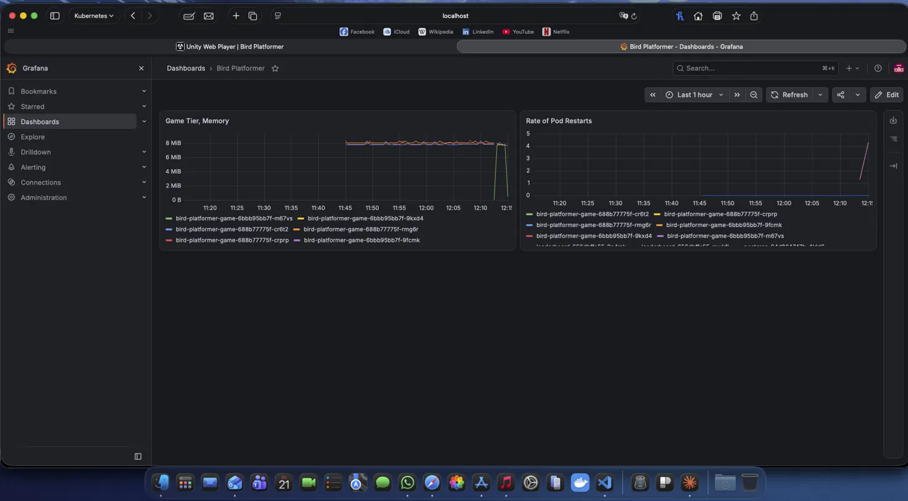

# Week 3 Day 3 — Prometheus, Grafana, and the monitoring stack as a workload

**Date:** 21 August 2026
**Outcome:** own dashboard (2 panels), one alert rule walked Normal → Pending → Firing,
and an unplanned capacity incident that took the API server down.

---

## The headline

> **The smoke alarm is itself a workload competing for the same resources as
> everything it watches.** An unsized monitoring stack can take down the cluster it
> was installed to observe.

Most of this session was not "learn Grafana." It was capacity planning, forced by
installing something that wanted ~1.3 Gi on a node with ~570 Mi of slack.

---

## Symptom → cause → fix

| Symptom | Cause | Fix |
|---|---|---|
| Grafana `2/3`, `CreateContainerConfigError`, RESTARTS climbing | **Not** a config error. Transient state while the sandbox is rebuilt mid-restart | Ignore the STATUS column; read the events |
| Events: `connection refused` early, `context deadline exceeded` later | Refused = booting, nothing listening yet. Deadline = listening but too slow. **Two different failures that look alike** | Note which one, and when |
| Liveness killed a healthy-but-slow Grafana | `QoS Class: BestEffort` — no requests, so the kubelet squeezes it first under node pressure | `helm upgrade --reuse-values --set grafana.resources.requests.memory=400Mi` → `Burstable` |
| Safari: "Unable to find application file" | Stale cached `index.html` pointing at hashed JS chunks that no longer exist in the new pod | Hard reload (Option+click reload on Safari) |
| `kubectl`: `Unable to connect to the server: TLS handshake timeout` | Node thrashed; **API server lost the CPU fight and stopped**. `minikube status`: `kubelet: Running, apiserver: Stopped` | `minikube stop && minikube start`. NEVER `minikube delete` — that destroys the PVC and Calico |
| `helm upgrade` → `spec.strategy.rollingUpdate: Forbidden … when type is 'Recreate'` | `rollingUpdate` was **defaulted onto the live Deployment object** by the API server, not set by Helm. Server-side apply reassembled the forbidden pair | `--set …rollingUpdate=null` did NOT work. Had to `kubectl delete deployment monitoring-grafana` and let Helm recreate it |
| Stock "Compute Resources / Namespace (Pods)" dashboard: quota tables populated, usage panels "No data" | cAdvisor on minikube-on-Docker (M1) emits **only pod-level** series — `container=""`, `image=""`. Stock panels filter `container!=""`, which matches nothing | Not fixable. Build own panels at pod granularity |
| Own memory panel: lines drop to zero and spike back | **Missing scrapes, not fluctuating memory.** Grafana connects across gaps, so a dropped scrape looks like a cliff | Prometheus is memory-constrained at 600 Mi. Cosmetic; noted |

---

## The number that was a lie

```
kubectl get node minikube -o jsonpath='{.status.capacity}'   →  memory: 8124776Ki  (7.75 Gi)
docker stats --no-stream minikube                            →  MEM 3.333GiB / 3.906GiB
```

**The kubelet advertised 7.75 Gi. The container it runs in is capped at 3.9 Gi.**
The scheduler was planning against memory that does not exist. Every downstream
calculation — including how much headroom the monitoring stack had — inherited the
error.

The cap is **minikube's** `--memory` default (4 GB), not Docker Desktop's (which was
already at 8 GB). Raising it requires `minikube delete`. Not worth the PVC.

> **A resource limit you can't see is worse than a low one.**
> `kubectl top nodes` reporting "41%" is 41% of a fiction. Check `docker stats`.

---

## What actually caused the outage

The steady state fitted: 3336 Mi against a 3906 Mi ceiling, stable for 46 hours.

What broke it was the **rolling update**, which briefly ran two Grafanas — +687 Mi on
a node with 570 Mi of slack. `BLOCK I/O 765GB` was the tell: thrashing, not work.

> **A rolling update temporarily needs room for both versions. On a node with no
> headroom, the update *is* the outage.**

Fix: `grafana.deploymentStrategy.type=Recreate`. Kill the old pod, *then* start the
new one. Trade a few seconds of downtime for never needing double the memory.

**Interview line:** *"On a single-node cluster the control plane competes with your
workloads for the same CPU. That's why real clusters put the control plane on
separate nodes — so a misbehaving pod can't take the API server down with it."*

---

## Helm lessons (early, from being a chart *consumer*)

- **`--reuse-values` is a merge, not an overwrite.** Values you don't pass survive.
  Handy — and a trap, because a leftover field you never mentioned can invalidate the
  one you did.
- **Helm owns the manifest; the API server owns the object.** A field Helm never wrote
  can still be on the live resource (API-server defaulting), and server-side apply will
  merge it back in. `--set key=null` removes it from *values*, not from the live object.
- `--set image.tag=…` / `--set grafana.resources…` is exactly the mechanism Day 6
  builds. Used it before writing it.

---

## Prometheus / Grafana vocabulary that stuck

**Scraping — Prometheus pulls, targets don't push.** It has a list of addresses and
visits each one every 15s. Push would mean every pod knowing Prometheus's address.

**Where infra metrics come from — and the NetworkPolicy consequence:**

```
Prometheus ──scrapes──▶ kubelet / cAdvisor   ("what is each container using?")
Prometheus ──scrapes──▶ API server            ("what pods exist?")
Prometheus ──✗ never ─▶ the game pod itself
```

`default-deny-ingress` on `bird-platformer` does **not** block infra metrics, because
no connection to the pod is ever attempted. **But** if Flask exposed its own `/metrics`,
Prometheus would dial the pod directly and default-deny **would** silently block it —
target shows `DOWN`, nothing in the app logs.

> **Infrastructure metrics come from the node for free. Application metrics come from
> the pod and need a hole in the wall.**

**Gauge vs counter:**

| Type | Behaviour | Panel |
|---|---|---|
| Gauge | up and down | `container_memory_working_set_bytes` |
| Counter | only up, resets when the pod is replaced | `kube_pod_container_status_restarts_total` |

A raw counter is nearly useless to look at — "7 restarts, ever" doesn't say when. Wrap
it: `increase(...[5m])` = "restarts in the last 5 minutes," a question worth asking.

**`working_set` vs `usage`:** working set is memory that can't be reclaimed without
hurting — what the OOM killer looks at. `container_memory_usage_bytes` includes
reclaimable page cache and will scare you for no reason.

---

## The sizing table (Day 2's homework, finally measured)

| Tier | Requested | Measured | Verdict |
|---|---|---|---|
| game (nginx ×3) | 32 Mi | **8.2 MB** | generous — ~4× headroom |
| leaderboard (×2) | 128 Mi | **115 Mi** | close to the line; the guess was good |

Answers "how did you size that?" with a measurement instead of a guess.

---

## The alert

```promql
sum by (pod) (increase(kube_pod_container_status_restarts_total{namespace="bird-platformer"}[5m]))
```

Threshold: IS ABOVE 2. Evaluation interval 2m. **Pending period 2m.**

Three separable parts: **the query** (what number), **the condition** (what's bad),
**the duration** (how long before I believe it).

**`Pending` is the state nobody knows exists.** Condition true, but not believed yet.
If it goes false before the clock runs out, nobody is ever told.

> **A duration threshold is an alert-fatigue control**, not a technical detail. Without
> it every blip pages someone, and within a month nobody reads the pages.
> Same instinct as `failureThreshold: 3` on a probe: slow to condemn.

**Latency is by design:** evaluation interval + pending period ≈ 4 min here. "Why did
it take four minutes to page?" has an answer, and it's a number you chose.

**The alert clears when the evidence ages out, not when the problem does** — the `[5m]`
window still contains the restarts for five minutes after they stop.

**Contact point: `empty`.** The rule fires and tells nobody. Deliberate:

> The **rule** is identical in dev, UAT and prod. The **routing** differs — Alertmanager
> matches on `namespace`/`environment` and sends prod to a pager, UAT to a chat channel,
> dev nowhere. **Not every environment deserves to wake someone.**

---

## The deliberate break (repeat of Day 1, now visible on a graph)

Pointed `livenessProbe` at `/does-not-exist`. Result across the two panels:

- **Restarts panel:** near-vertical climb to 4.
- **Memory panel:** flat at 8 MiB the whole time; three *new* pod names appeared as the
  edit triggered a new ReplicaSet.

> **Flat memory, climbing restarts, `READY 1/1`.** Nothing leaking, nothing starving,
> the app answering correctly — and still dying. That combination points at the probe,
> not the workload. Readiness and liveness are independent judges who never consult
> each other.

---

## Debugging reflexes reinforced

- **Go to the source.** `kubectl get --raw "/api/v1/nodes/minikube/proxy/metrics/cadvisor"`
  bypassed Prometheus and Grafana entirely and settled the question in one command.
  Don't debug a dashboard when you can ask the thing that produces the number.
- **"No rows matched" renders identically to "no data exists."** The stock dashboard's
  `container!=""` filter was three layers away from where the symptom appeared.
- **A jagged line can mean the metric is jagged, or the collection is.**
- `minikube status` talks to Docker, not the API server — it works when `kubectl`
  doesn't. Check the building before the room.
- `Unable to connect to the server` = the API server. `Metrics API not available` =
  one addon behind it. Different depth, similar words.

---

## Open items

- [ ] Add the `$namespace` template variable to the dashboard (needed for Day 4's
      `bird-dev` comparison; it's the Helm values-file principle three days early)
- [ ] Set panel Y-axis max on the restarts panel so a single restart is visible
- [ ] Read the Alertmanager routing-tree section — enough to say the sentence, not to
      wire a pager
- [ ] Screenshot for the README: restart spike + alert in `Pending`# Week 3 Day 3 — Prometheus, Grafana, and the monitoring stack as a workload

**Date:** 21 August 2026
**Outcome:** own dashboard (2 panels), one alert rule walked Normal → Pending → Firing,
and an unplanned capacity incident that took the API server down.

---

## The headline

> **The smoke alarm is itself a workload competing for the same resources as
> everything it watches.** An unsized monitoring stack can take down the cluster it
> was installed to observe.

Most of this session was not "learn Grafana." It was capacity planning, forced by
installing something that wanted ~1.3 Gi on a node with ~570 Mi of slack.

---

## Symptom → cause → fix

| Symptom | Cause | Fix |
|---|---|---|
| Grafana `2/3`, `CreateContainerConfigError`, RESTARTS climbing | **Not** a config error. Transient state while the sandbox is rebuilt mid-restart | Ignore the STATUS column; read the events |
| Events: `connection refused` early, `context deadline exceeded` later | Refused = booting, nothing listening yet. Deadline = listening but too slow. **Two different failures that look alike** | Note which one, and when |
| Liveness killed a healthy-but-slow Grafana | `QoS Class: BestEffort` — no requests, so the kubelet squeezes it first under node pressure | `helm upgrade --reuse-values --set grafana.resources.requests.memory=400Mi` → `Burstable` |
| Safari: "Unable to find application file" | Stale cached `index.html` pointing at hashed JS chunks that no longer exist in the new pod | Hard reload (Option+click reload on Safari) |
| `kubectl`: `Unable to connect to the server: TLS handshake timeout` | Node thrashed; **API server lost the CPU fight and stopped**. `minikube status`: `kubelet: Running, apiserver: Stopped` | `minikube stop && minikube start`. NEVER `minikube delete` — that destroys the PVC and Calico |
| `helm upgrade` → `spec.strategy.rollingUpdate: Forbidden … when type is 'Recreate'` | `rollingUpdate` was **defaulted onto the live Deployment object** by the API server, not set by Helm. Server-side apply reassembled the forbidden pair | `--set …rollingUpdate=null` did NOT work. Had to `kubectl delete deployment monitoring-grafana` and let Helm recreate it |
| Stock "Compute Resources / Namespace (Pods)" dashboard: quota tables populated, usage panels "No data" | cAdvisor on minikube-on-Docker (M1) emits **only pod-level** series — `container=""`, `image=""`. Stock panels filter `container!=""`, which matches nothing | Not fixable. Build own panels at pod granularity |
| Own memory panel: lines drop to zero and spike back | **Missing scrapes, not fluctuating memory.** Grafana connects across gaps, so a dropped scrape looks like a cliff | Prometheus is memory-constrained at 600 Mi. Cosmetic; noted |

---

## The number that was a lie

```
kubectl get node minikube -o jsonpath='{.status.capacity}'   →  memory: 8124776Ki  (7.75 Gi)
docker stats --no-stream minikube                            →  MEM 3.333GiB / 3.906GiB
```

**The kubelet advertised 7.75 Gi. The container it runs in is capped at 3.9 Gi.**
The scheduler was planning against memory that does not exist. Every downstream
calculation — including how much headroom the monitoring stack had — inherited the
error.

The cap is **minikube's** `--memory` default (4 GB), not Docker Desktop's (which was
already at 8 GB). Raising it requires `minikube delete`. Not worth the PVC.

> **A resource limit you can't see is worse than a low one.**
> `kubectl top nodes` reporting "41%" is 41% of a fiction. Check `docker stats`.

---

## What actually caused the outage

The steady state fitted: 3336 Mi against a 3906 Mi ceiling, stable for 46 hours.

What broke it was the **rolling update**, which briefly ran two Grafanas — +687 Mi on
a node with 570 Mi of slack. `BLOCK I/O 765GB` was the tell: thrashing, not work.

> **A rolling update temporarily needs room for both versions. On a node with no
> headroom, the update *is* the outage.**

Fix: `grafana.deploymentStrategy.type=Recreate`. Kill the old pod, *then* start the
new one. Trade a few seconds of downtime for never needing double the memory.

**Interview line:** *"On a single-node cluster the control plane competes with your
workloads for the same CPU. That's why real clusters put the control plane on
separate nodes — so a misbehaving pod can't take the API server down with it."*

---

## Helm lessons (early, from being a chart *consumer*)

- **`--reuse-values` is a merge, not an overwrite.** Values you don't pass survive.
  Handy — and a trap, because a leftover field you never mentioned can invalidate the
  one you did.
- **Helm owns the manifest; the API server owns the object.** A field Helm never wrote
  can still be on the live resource (API-server defaulting), and server-side apply will
  merge it back in. `--set key=null` removes it from *values*, not from the live object.
- `--set image.tag=…` / `--set grafana.resources…` is exactly the mechanism Day 6
  builds. Used it before writing it.

---

## Prometheus / Grafana vocabulary that stuck

**Scraping — Prometheus pulls, targets don't push.** It has a list of addresses and
visits each one every 15s. Push would mean every pod knowing Prometheus's address.

**Where infra metrics come from — and the NetworkPolicy consequence:**

```
Prometheus ──scrapes──▶ kubelet / cAdvisor   ("what is each container using?")
Prometheus ──scrapes──▶ API server            ("what pods exist?")
Prometheus ──✗ never ─▶ the game pod itself
```

`default-deny-ingress` on `bird-platformer` does **not** block infra metrics, because
no connection to the pod is ever attempted. **But** if Flask exposed its own `/metrics`,
Prometheus would dial the pod directly and default-deny **would** silently block it —
target shows `DOWN`, nothing in the app logs.

> **Infrastructure metrics come from the node for free. Application metrics come from
> the pod and need a hole in the wall.**

**Gauge vs counter:**

| Type | Behaviour | Panel |
|---|---|---|
| Gauge | up and down | `container_memory_working_set_bytes` |
| Counter | only up, resets when the pod is replaced | `kube_pod_container_status_restarts_total` |

A raw counter is nearly useless to look at — "7 restarts, ever" doesn't say when. Wrap
it: `increase(...[5m])` = "restarts in the last 5 minutes," a question worth asking.

**`working_set` vs `usage`:** working set is memory that can't be reclaimed without
hurting — what the OOM killer looks at. `container_memory_usage_bytes` includes
reclaimable page cache and will scare you for no reason.

---

## The sizing table (Day 2's homework, finally measured)

| Tier | Requested | Measured | Verdict |
|---|---|---|---|
| game (nginx ×3) | 32 Mi | **8.2 MB** | generous — ~4× headroom |
| leaderboard (×2) | 128 Mi | **115 Mi** | close to the line; the guess was good |

Answers "how did you size that?" with a measurement instead of a guess.

---

## The alert

```promql
sum by (pod) (increase(kube_pod_container_status_restarts_total{namespace="bird-platformer"}[5m]))
```

Threshold: IS ABOVE 2. Evaluation interval 2m. **Pending period 2m.**

Three separable parts: **the query** (what number), **the condition** (what's bad),
**the duration** (how long before I believe it).

**`Pending` is the state nobody knows exists.** Condition true, but not believed yet.
If it goes false before the clock runs out, nobody is ever told.


> **A duration threshold is an alert-fatigue control**, not a technical detail. Without
> it every blip pages someone, and within a month nobody reads the pages.
> Same instinct as `failureThreshold: 3` on a probe: slow to condemn.

**Latency is by design:** evaluation interval + pending period ≈ 4 min here. "Why did
it take four minutes to page?" has an answer, and it's a number you chose.

**The alert clears when the evidence ages out, not when the problem does** — the `[5m]`
window still contains the restarts for five minutes after they stop.

**Contact point: `empty`.** The rule fires and tells nobody. Deliberate:

> The **rule** is identical in dev, UAT and prod. The **routing** differs — Alertmanager
> matches on `namespace`/`environment` and sends prod to a pager, UAT to a chat channel,
> dev nowhere. **Not every environment deserves to wake someone.**

---

## The deliberate break (repeat of Day 1, now visible on a graph)

Pointed `livenessProbe` at `/does-not-exist`. Result across the two panels:

- **Restarts panel:** near-vertical climb to 4.
- **Memory panel:** flat at 8 MiB the whole time; three *new* pod names appeared as the
  edit triggered a new ReplicaSet.



> **Flat memory, climbing restarts, `READY 1/1`.** Nothing leaking, nothing starving,
> the app answering correctly — and still dying. That combination points at the probe,
> not the workload. Readiness and liveness are independent judges who never consult
> each other.

---

## Debugging reflexes reinforced

- **Go to the source.** `kubectl get --raw "/api/v1/nodes/minikube/proxy/metrics/cadvisor"`
  bypassed Prometheus and Grafana entirely and settled the question in one command.
  Don't debug a dashboard when you can ask the thing that produces the number.
- **"No rows matched" renders identically to "no data exists."** The stock dashboard's
  `container!=""` filter was three layers away from where the symptom appeared.
- **A jagged line can mean the metric is jagged, or the collection is.**
- `minikube status` talks to Docker, not the API server — it works when `kubectl`
  doesn't. Check the building before the room.
- `Unable to connect to the server` = the API server. `Metrics API not available` =
  one addon behind it. Different depth, similar words.

---

## Open items

- [ ] Add the `$namespace` template variable to the dashboard (needed for Day 4's
      `bird-dev` comparison; it's the Helm values-file principle three days early)
- [ ] Set panel Y-axis max on the restarts panel so a single restart is visible
- [ ] Read the Alertmanager routing-tree section — enough to say the sentence, not to
      wire a pager
- [ ] Screenshot for the README: restart spike + alert in `Pending`